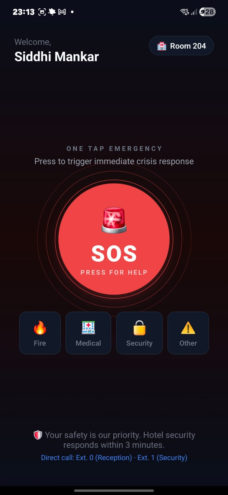
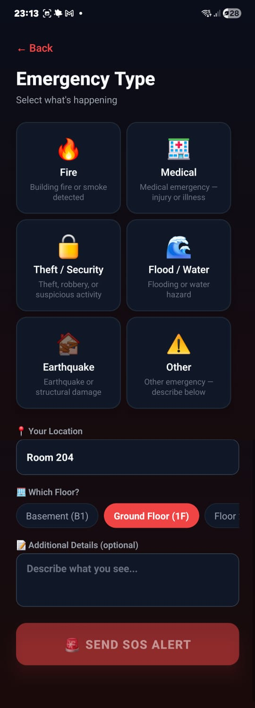
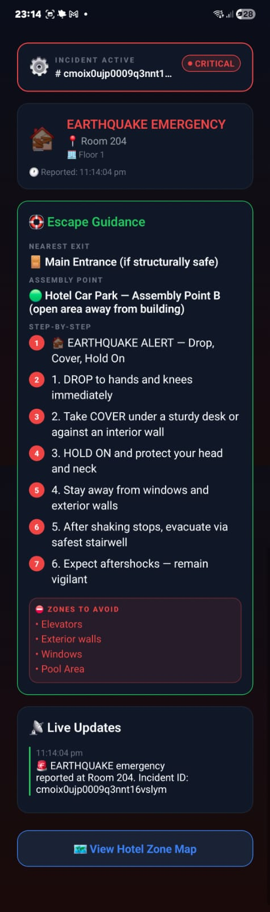
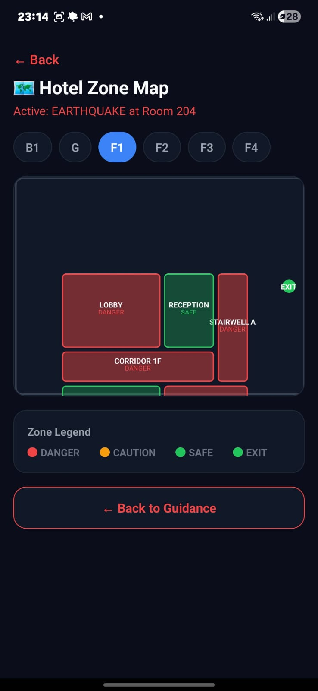
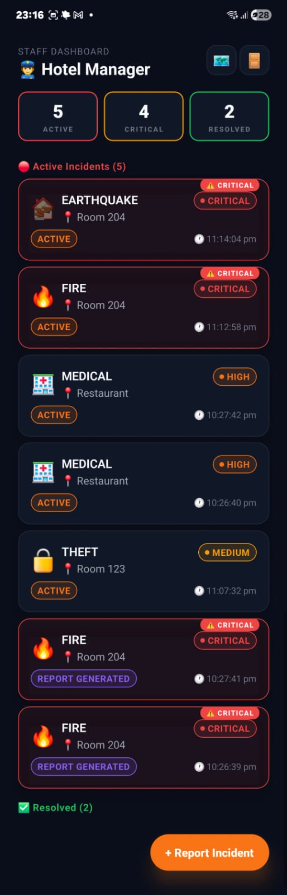
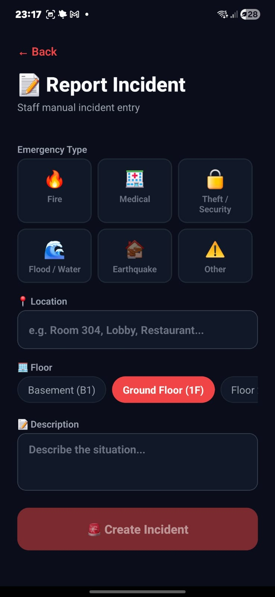
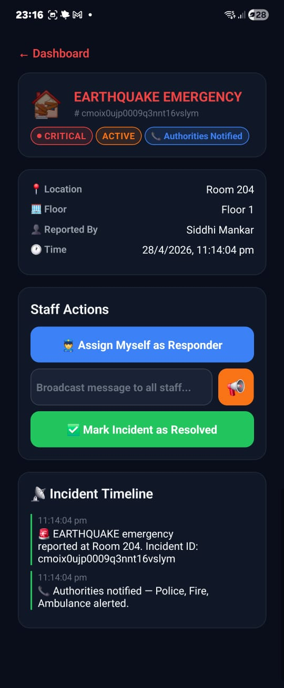
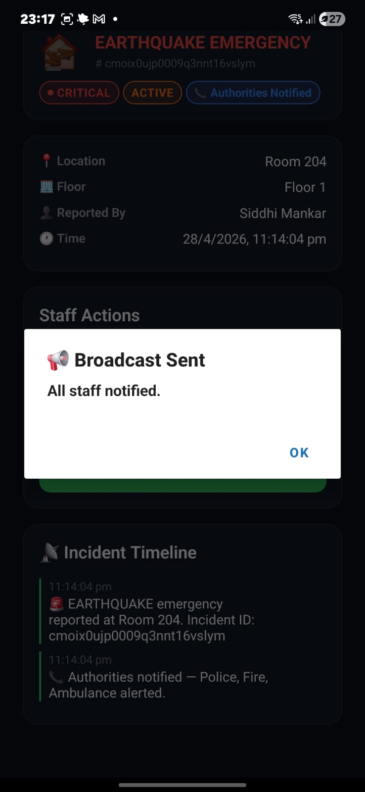
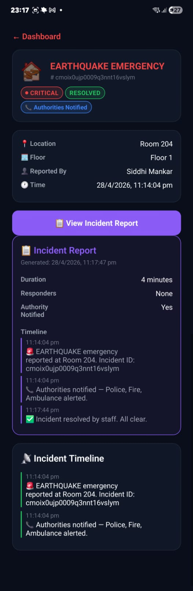

# EvacuAid 🚨

🎥 **[Watch the Demo Video](https://drive.google.com/file/d/1DUhAJjuVzXQEWjyn658ilmGaL8HRkGZl/view?usp=drivesdk)**

**EvacuAid** is a real-time emergency management and rapid-response platform designed for large, high-occupancy facilities like hotels and corporate campuses. 

During a crisis (such as a fire, medical emergency, or security threat), traditional communication breaks down. EvacuAid bridges this gap by providing a unified crisis management engine that connects guests directly to staff, automates emergency protocols, and ensures no one is left behind.

---

## 🌟 Key Features

*   **Dual-Persona Interface**: Distinct, streamlined workflows for Guests (One-Tap SOS) and Staff (Crisis Dashboard).
*   **Real-Time Synchronization**: Zero-latency incident tracking and status updates powered by Socket.IO.
*   **Automated Crisis Engine**: Auto-classifies incidents by severity and generates dynamic evacuation guidance.
*   **External Authority Escalation**: Integrates with Twilio to automatically dispatch SMS alerts to emergency services for critical incidents.
*   **Offline Resilience**: Mobile app queues actions when disconnected and syncs automatically upon network restoration.
*   **Zone Mapping**: Visualizes facility zones to identify safe vs. dangerous areas during an emergency.

---

## 📸 Screenshots

| Screenshot | Description |
| :---: | :--- |
|  | **Guest Home Screen**<br>The main interface for guests, featuring a prominent, high-contrast SOS button for instant emergency triggering. |
|  | **Emergency Triage**<br>Guests can select the specific type of emergency (Fire, Medical, Earthquake) to provide immediate context to the Crisis Engine. |
|  | **Escape Guidance**<br>Dynamic, step-by-step survival and evacuation instructions tailored specifically to the type of emergency reported. |
|  | **Interactive Zone Map**<br>A live visual map of the facility highlighting danger zones (red) and safe zones (green) to guide safe evacuation routing. |
|  | **Staff Dashboard**<br>A real-time overview for security and management, displaying all active, critical, and resolved incidents sorted by severity. |
|  | **Manual Incident Reporting**<br>Staff members can manually log incidents they discover directly into the system, bypassing the guest workflow. |
|  | **Incident Details & Assignment**<br>The detailed view where staff can assign themselves as responders and execute resolution actions. |
|  | **Emergency Broadcasts**<br>Staff can instantly broadcast messages or alerts to all other personnel via the live Socket.IO connection. |
|  | **Automated Incident Reports**<br>Once an emergency is marked as resolved, the system generates a full timeline report of all actions taken for auditing. |

---

## 🛠 Tech Stack

EvacuAid is built using a modern, full-stack monorepo architecture (via NPM Workspaces).

### Frontend (Mobile App - `apps/mobile`)
*   **Framework**: React Native with Expo (SDK 51)
*   **Language**: TypeScript
*   **State Management**: Zustand
*   **Navigation**: React Navigation
*   **Networking/Real-time**: Axios & Socket.IO Client

### Backend (API - `packages/api`)
*   **Framework**: Node.js & Express
*   **Language**: TypeScript
*   **Real-time Communication**: Socket.IO (Server)
*   **Database Engine**: PostgreSQL
*   **ORM**: Prisma
*   **Caching/PubSub**: Redis

---

## 🚀 Getting Started

Follow these steps to get the project running locally.

### Prerequisites
*   [Node.js](https://nodejs.org/) (v18+)
*   [Docker](https://www.docker.com/) & Docker Compose
*   [Expo Go App](https://expo.dev/client) installed on your physical mobile device.

### 1. Installation
Clone the repository and install dependencies across all workspaces:
```bash
npm install
```

### 2. Environment Variables
Create a `.env` file in `packages/api/` based on the provided example:
```bash
cp packages/api/.env.example packages/api/.env
```
*Note: You must ensure `TWILIO_ACCOUNT_SID` starts with `AC` or is left empty to avoid initialization crashes during local development.*

### 3. Start Infrastructure (Database & Redis)
Ensure Docker is running, then spin up the required services:
```bash
docker-compose up -d
```

### 4. Database Setup & Seeding
Push the Prisma schema to the database:
```bash
npm run dev:db-push
```

### 5. Start the Backend API
From the root of the project, start the Express server:
```bash
npm run dev:api
```
The API will be available at `http://localhost:4000`.

### 6. Start the Mobile App
Open a new terminal, ensure you are connected to the same Wi-Fi network as your phone, and start the Expo server:
```bash
cd apps/mobile
npx expo start -c
```
Scan the generated QR code with the Expo Go app on your phone, or manually enter the `exp://<YOUR-LOCAL-IP>:8081` URL.

---

## 🧪 Testing

The project includes an automated end-to-end (E2E) Bash script that simulates the entire incident lifecycle (Login → Incident Creation → Guidance → Assignment → Resolution).

To run the E2E smoke tests against your local environment:
1. Ensure your backend and database are running.
2. Execute the script from the root directory:
```bash
bash test_e2e.sh
```

---

## 📁 Project Structure

```text
EvacuAid/
├── apps/
│   └── mobile/          # React Native (Expo) frontend
├── packages/
│   ├── api/             # Express/Node.js backend
│   └── shared/          # Shared TypeScript interfaces & types
├── docker-compose.yml   # Postgres & Redis infrastructure
└── test_e2e.sh          # E2E Smoke test script
```
